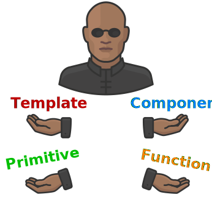

# Polymorpheus

[](https://npmjs.com/package/@tinkoff/ng-polymorpheus)
[](https://coveralls.io/github/TinkoffCreditSystems/ng-polymorpheus?branch=master)
[](https://github.com/TinkoffCreditSystems/angular-open-source-starter)
[](https://t.me/taiga_ui)

**Polymorpheus** is a tiny library for polymorphic templates in Angular.

It is 1 KB gzip, dependency free and allows you to make pretty cool things.



## What does it do?

It abstracts over different ways of view customization in Angular with one simple _structural directive_:

```html
<ng-container *polymorpheusOutlet="content as text; context: context">
    {{text}}
</ng-container>
```

**Content** accepts:

-   primitives like `number` or `string`
-   functions that take `context` as argument and return a primitive
-   templates that get instantiated with given `context`
-   components that would get `context` injected through DI

**Context** is optional when you need your **content** to adapt to the situation

## How to use it?

Typical use case would be a component that accepts visual customization and defines
context by itself. Say a menu list where you can configure how each item should look
like by passing a template. And context would be item itself and, for example,
whether it is focused or not.

Please see [extensive demo](https://stackblitz.com/edit/polymorpheus-demo) (wait for packages to install and run `npm start`).

You can also [read about this concept in detail](https://medium.com/angular-in-depth/agnostic-components-in-angular-2427923b742d).

### Accessing context in dynamic component

If you use component content you can inject context with `POLYMORPHEUS_CONTEXT` token.

**Important!** This object is _live_ so if you change it, your component will not be recreated:

```ts
@Component({
  template: '{{context.active}}`, // <-- this will automatically update
  changeDetection: ChangeDetectionStrategy.OnPush,
})
export class MyComponent {
  constructor(
    @Inject(POLYMORPHEUS_CONTEXT) readonly context: { active: boolean }
  ) {}
}
```

### Adding type to template context

You can use `polymorpehus` directive to add type to template context:

```typescript
readonly context!: { $implicit: number };
```

```html
<ng-template #template="polymorpheus" [polymorpheus]="context" let-item>
    {{ item.toFixed(2) }} <-- type 'number'
</ng-template>
```

## Open-source

Do you also want to open-source something, but hate the collateral work?
Check out this [Angular Open-source Library Starter](https://github.com/TinkoffCreditSystems/angular-open-source-starter)
we’ve created for our projects. It got you covered on continuous integration,
pre-commit checks, linting, versioning + changelog, code coverage and all that jazz.

## Core team

<table>
    <tr>
       <td align="center">
            <a href="https://twitter.com/waterplea"
                ><br /><b>Alex Inkin</b></a
            >
            <div style="margin-top: 4px">
                <a
                    href="https://twitter.com/waterplea"
                    title="Twitter"
                    ></a>
                <a href="https://github.com/waterplea" title="Github"
                    ></a>
                <a
                    href="https://t.me/waterplea"
                    title="Telegram"
                    ></a>
            </div>
        </td>
        <td align="center">
            <a href="https://twitter.com/marsibarsi"
                ><br /><b>Roman Sedov</b></a
            >
            <div style="margin-top: 4px">
                <a
                    href="https://twitter.com/marsibarsi"
                    title="Twitter"
                    ></a>
                <a
                    href="https://github.com/marsibarsi"
                    title="GitHub"
                    ></a>
                <a
                    href="https://t.me/marsibarsi"
                    title="Telegram"
                    ></a>
            </div>
        </td>
    </tr>
</table>

**ng-polymorpheus** is a part of [Taiga UI](https://github.com/Tinkoff/taiga-ui) libraries family which is backed and used by a
large enterprise. This means you can rely on timely support and continuous development.
